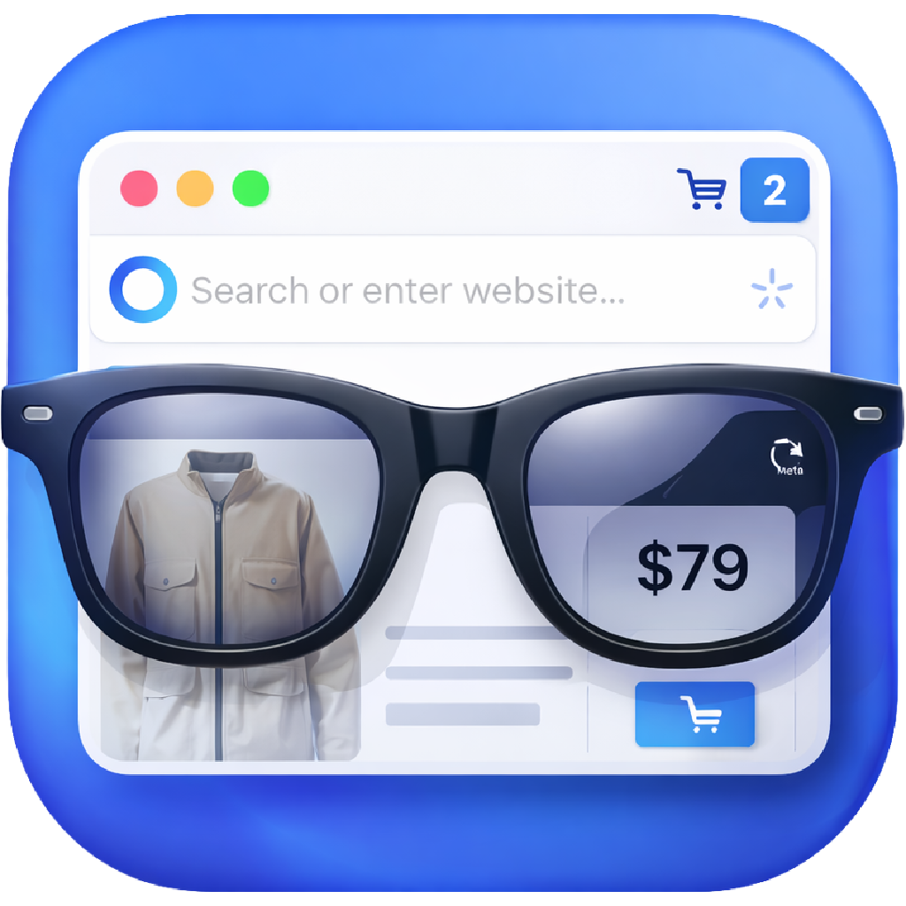

<p align="center">
  
</p>

# Meta Browser Commerce

**Hands-free product search & purchase on Meta AI Glasses**

Native iOS Swift app and supporting materials for the Meta AI grant application.

## Overview

Meta Browser Commerce lets users search, compare, and buy products by voice on Meta AI Glasses. The companion app captures voice requests, runs search across retailers via web discovery (Omnia MCP + browser-use), and speaks results and prices over the glasses. Users can add items to cart and complete purchases without using a phone.

## iOS App (Swift / SwiftUI)

| Component | Description |
|-----------|-------------|
| **Pairing** | Connect Meta AI Glasses via Meta Wearables DAT SDK |
| **Home** | Voice prompt examples, connection status, recent activity |
| **Search** | Multi-retailer product results (Nike, Amazon, Target) |
| **Compare** | Side-by-side product comparison, add to cart |
| **Cart** | Items added by voice, checkout flow |

### Build & Run

1. Open `MetaBrowserCommerce.xcodeproj` in Xcode.
2. Select iPhone simulator (e.g. iPhone 17) and run (⌘R).
3. Add Meta DAT: **File → Add Package Dependencies** → `https://github.com/facebook/meta-wearables-dat-ios`

### Test the full flow

1. **Pair CTA** – If you skipped pairing, a "Pair Meta AI Glasses" banner appears on Home. Tap to pair.
2. **Search** – Type a query (e.g. "running shoes") and tap the search button, or tap any voice example.
3. **Browser view** – A Nike.com search loads in a WebView; results appear below.
4. **Add to cart** – Tap "Add to Cart" on a result → navigates to Cart tab.
5. **Checkout** – Tap "Checkout" for confirmation.

### Trigger search from command line

With the app running in the simulator:

```bash
xcrun simctl openurl booted "metabrowsercommerce://search?q=running+shoes"
```

### Features

| Feature | Description |
|--------|-------------|
| **Animated placeholder** | Test flow field cycles through example prompts (light grey, fade) |
| **Settings** | Top-right gear icon → manage 3rd party platform logins (Amazon, Nike, Target, Walmart, Best Buy) |
| **Launch Glasses Camera** | Search tab → prominent button to start camera/voice on AI Glasses |
| **Confirm flow** | Results → tap product → "Confirm & Add to cart?" → Cart → Checkout (Review → Payment → Confirm) |

### Amazon login (known limitation)

Amazon often blocks in-app WebView login. If Connect fails:

1. Use **"Open in Safari instead"** in the login screen
2. Sign in via Safari (session lives in Safari, not in-app)
3. For in-app browsing with login: use [Login with Amazon](https://developer.amazon.com/docs/login-with-amazon/ios-docs.html) (requires Amazon Developer registration)

### Glasses camera workflow (VisionClaw-inspired)

See **[VISION_WORKFLOW.md](VISION_WORKFLOW.md)** for the full architecture. In short:

- **Meta DAT SDK** streams video (~1fps) + mic from glasses
- Voice intent → MCP `run_browser_task` → retailer search
- Results → TTS → spoken to user on glasses
- Same pattern as [VisionClaw](https://github.com/sseanliu/VisionClaw), applied to commerce

### Grant Application Materials

| Type | Source | Description |
|------|--------|-------------|
| **Mobile app screens** | iOS app | Pairing, Home, Search Results, Compare, Cart |
| **Voice flow diagram** | `flow-diagram.html` | Technical flow for grant images |

## Technical flow

```
User (glasses) 
  → Mobile app (voice from Meta DAT)
    → Intent parsing → MCP client
      → run_browser_task / execute_website_action
        → browser-use on retailer URLs
          → structured result
    → TTS → Meta DAT → glasses (audio)
```

## APIs & integration

- **Omnia MCP** (run_browser_task, execute_website_action)
- **Meta DAT SDK** (pairing, voice capture, TTS output)
- **Retailer sites** via browser-use (no onboarding required)

## Project structure

```
Meta-Browser-Commerce/
├── MetaBrowserCommerce.xcodeproj/
├── MetaBrowserCommerce/
│   ├── MetaBrowserCommerceApp.swift
│   ├── AppState.swift
│   ├── RootView.swift
│   ├── Views/           # PairingView, HomeView, SearchResultsView, CompareView, CartView
│   ├── Models/          # ProductResult, CartItem
│   ├── Services/        # MetaDATService (placeholder for Meta DAT)
│   └── Assets.xcassets/
├── flow-diagram.html    # Voice flow diagram for grant
├── index.html           # HTML mockup (optional demo)
└── README.md
```
